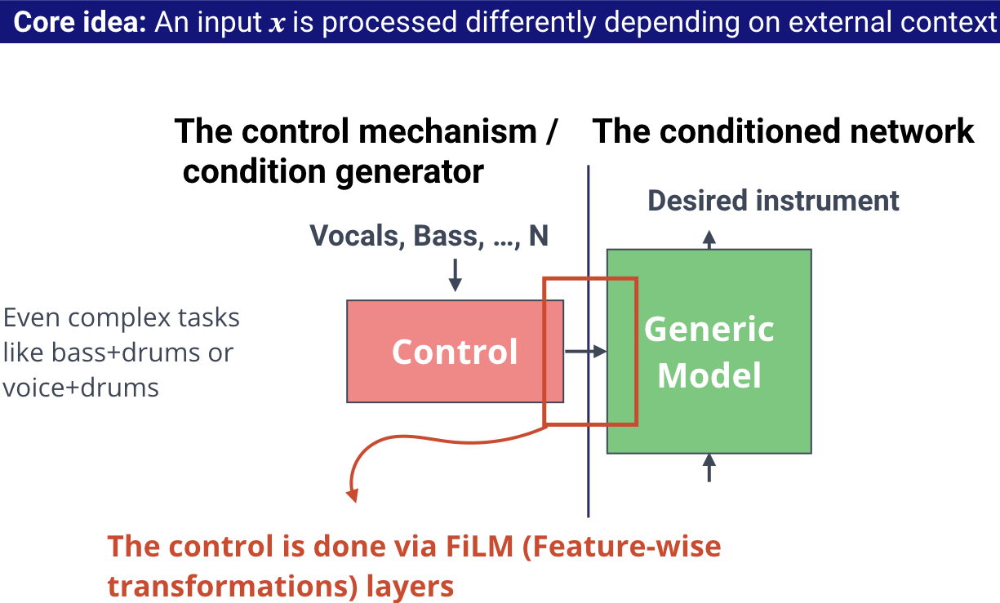
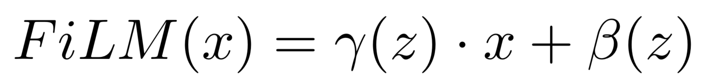
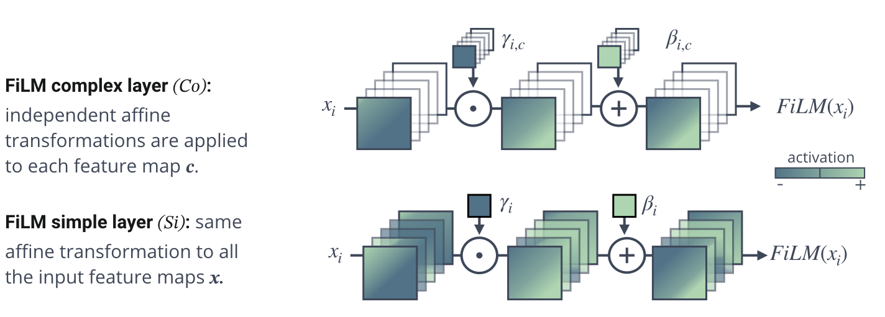
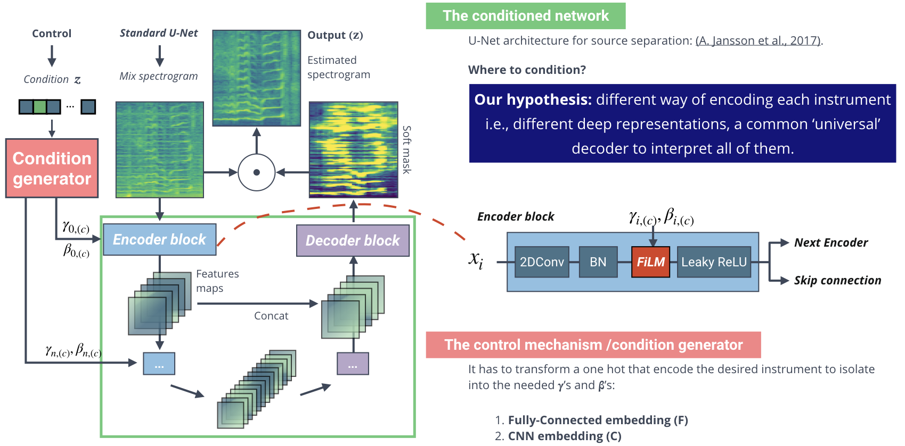

# Conditioned-U-Net for multitask musical instrument source separations


## How to use this package:

Three different modules. Each one perform a different step of the process. Look the different README to learn how to use it.

  ```
  └── cunet
      ├── __init__.py
      ├── evaluation
      ├── preprocess
      └── train
  ```
  - Prepare the input data at: code/preprocess

  ```
  └── preprocess
      ├── README.md
      ├── __init__.py
      ├── config.py
      ├── indexes.py
      └── spectrogram.py
  ```

  - Train a new model at: code/train
  ```
  └── train
      ├── README.md
      ├── __init__.py
      ├── config.py
      ├── data_loader.py
      ├── main.py
      ├── models
      │   ├── FiLM_utils.py
      │   ├── __init__.py
      │   ├── control_models.py
      │   ├── cunet_model.py
      │   └── unet_model.py
      └── others
          ├── __init__.py
          ├── lock.py
          ├── utilities.py
          └── val_files.py
  ```
  - Evaluate a model at: code/evaluation

    ```
    └── evaluation
        ├── README.md
        ├── __init__.py
        ├── config.py
        └── results.py
    ```


## Overview:

In this work we introduce a control mechanisms to the U-Net architecture.
This control mechanism permits multiple instrument source separations with a single model without losing any performance.

It is motivated by the idea that we can process the same input differently depending of some external context.



We have two main elements:

- **Generic model**: not specialized in any particular task, but rather in finding a set of generic source separation tools.
- **Control**: that defines how to combine the set of tools.

In our system, we just need to specify which instrument (or combination of instruments) we want to isolate.
Then the control will tell to the generic model what to do in order to isolate the desired instrument(s).
The key question is how to efficiently control the generic model.
We do that using FiLM layers.

## FiLM layers:

FiLM permits to modulate any neural network architecture inserting one or several FiLM layers at any depth of the original model [1]:



x is the input of the FiLM layer and gamma and beta the learnable parameters that scale and shift x based on an external information, z.

The original FiLM computes a different operation per features map, and we propose a new layer that performs the same affine operation to the whole input.




## Our architecture:

Overview of the system.



#### Generic model
The generic model is a U-Net[2] and it has to main part:
- **The decoder** codifies and highlights the relevant information to separate a particular instrument creating a latent space.
- **The encoder** transforms the latent space back to audio signal.

It is important to decide where to condition. And we think that it is essential to be able to create different latent spaces per instrument. Therefore, we condition only the decoder. FiLM layers are applied at each encoder block after batch normalization.

#### Condition generator
The condition generator takes as input a vector with the desired instrument to separate and compute the gammas and betas that control the generic model. We test two different configurations based on fully-connected architecture and convolutional one.  

Both systems are trained jointly.

You can find a detailed explanation at:
**[Meseguer-Brocal_2018]** [G. Meseguer-Brocal and G. Peeters. CONDITIONED-U-NET: Introducing a Control Mechanism in the U-net For Multiple Source Separations.](https://zenodo.org/record/3527766) or a new version with small corrections at [arxiv](https://arxiv.org/abs/1907.01277).

Cite this paper:

>@inproceedings{Meseguer-Brocal_2019,
	Author = {Meseguer-Brocal, Gabriel and Peeters, Geoffroy},
	Booktitle = {20th International Society for Music Information Retrieval Conference},
	Editor = {ISMIR},
	Month = {November},
	Title = {CONDITIONED-U-NET: Introducing a Control Mechanism in the U-net For Multiple Source Separations.},
	Year = {2019}}

You can contact us at:

  > gabriel dot meseguerbrocal at ircam dot fr


#### References:

[1] *E. Perez, F. Strub, H. de Vries, V. Dumoulin, and A. C. Courville. Film: Visual reasoning with a general condition- ing layer. In Proc. of AAAI (Conference on Artificial Intelligence), New Orleans, LA, USA, 2018.*

[2] *A.Jansson, N.Montecchio, R.Bittner, A.Kumar, T.Weyde, E. J. Humphrey. Singing voice separation with deep u-net convolutional networks. In Proc. of ISMIR (International Society for Music Information Retrieval), Suzhou, China, 2017.*
